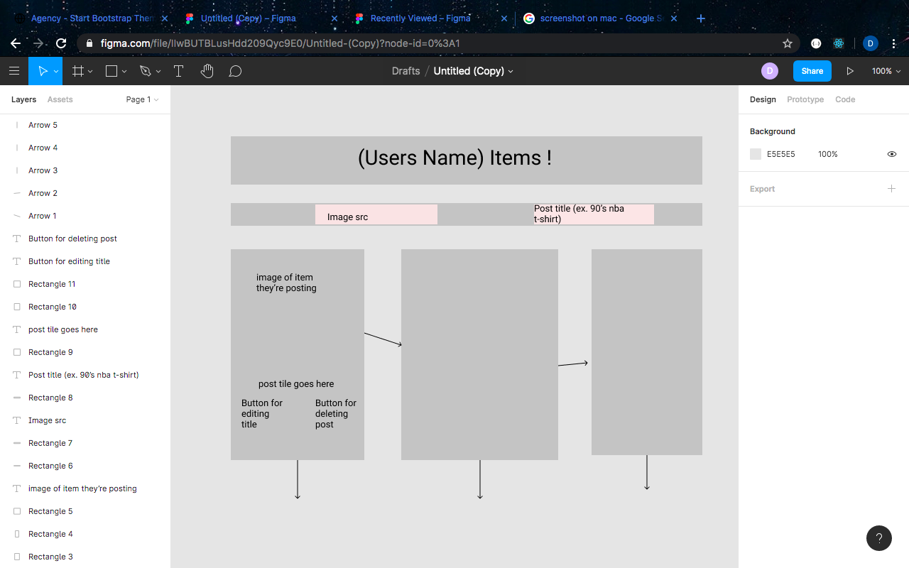

# Item selling app

## Application Concept and Wireframe

### Application Concept

- This is a sellers webpage.
- We will be utilizing a local API for the items data
- Full CRUD
  - GET: get all items
  - POST: New items will be posted to our array
  - PUT: Change the items price and/or name
  - Delete: Delete item from the profile

### Functionality
- We want a navabar at the top to display links.
- We want a header at the top of the page to display the name of the user
- When the app loads, the items already in the JSON file will be loaded on the screen
- When the input boxes are filled in and submitted, new item will appear on screen. 

### Endpoints

- GET - fetch items from API (retrieve it on front/back)
- GET - fetch our items
- POST - push new items to our items array
- PUT - change items name and price
- DELETE - delete our items from the array

### Component Architecture

- App.js (stateful: hold our items information, this.state.items)
- Navbar (Functonal)
  - Header.js (stateful: has an alert function when clicking 'sign out' button)
  - Display.js (functinal )
    - footer.js (functional)
  - input.js.js (stateful: this.state = {
                img: "",
                title: "",
                price: ""
            })
    - items.js (stateful: this.state = {
            items: [this.props.data],
            isEdit: false,
            price: "",
            title: ""
        })

### Wireframe

#Happy Coding !
